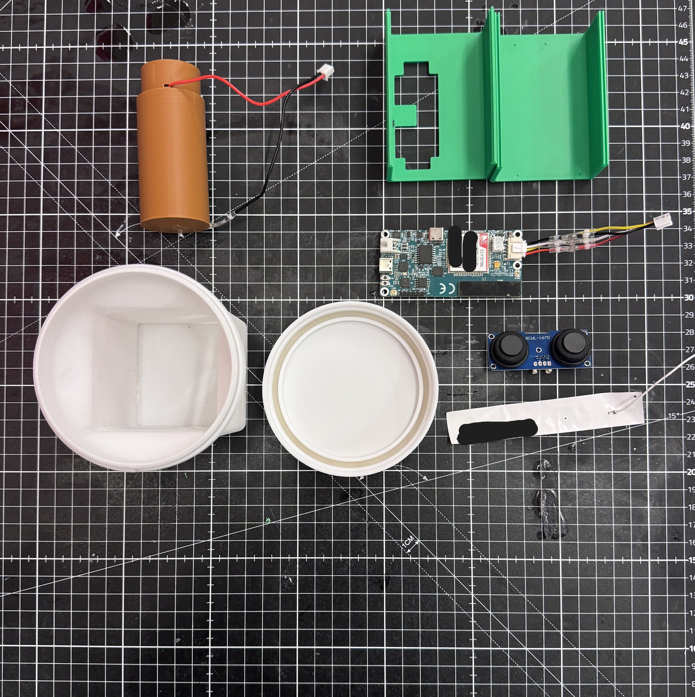

# industrial-iot-water-systems

Industrial IoT hardware systems designed for reliable environmental monitoring and smart water management under harsh operating conditions.

**Role:** Mechanical & Product Engineer
**Company:** IreckonCity B.V
**Status:** Ongoing (portfolio representation)
**Domain:** Industrial IoT • Smart Infrastructure • Product Engineering

---

##  Overview

At IreckonCity, I lead the mechanical design and product development of IoT-enabled water management devices. The work focuses on delivering robust, manufacturable, and regulation-ready hardware capable of operating reliably under environmental stress conditions.

My role spans concept development through validation, with strong emphasis on design for manufacturability (DFM), system integration, and cross-functional collaboration.

---

##  Key Responsibilities

* Lead mechanical design and rapid prototyping of IoT smart systems
* Ensure mechanical reliability under environmental stress conditions
* Optimize designs for scalable manufacturing
* Support system integration across mechanical, electrical, and software domains
* Develop validation protocols and technical documentation

---

##  Engineering Contributions

### Mechanical Design & Enclosure Development

* Designed robust device enclosures for outdoor and industrial environments
* Addressed sealing strategy and environmental protection considerations
* Balanced structural integrity with manufacturability
* Supported IP-rated design approaches (IP68)

.
.

---

### Design for Manufacturability (DFM)

Optimized products for multiple manufacturing routes:

* Injection molding
* Blow molding
* Vacuum casting
* Additive manufacturing (FDM, SLS)

**Focus areas:**

* draft angles and parting strategy
* wall thickness optimization
* tooling feasibility
* cost-aware geometry decisions

---

### System Integration

Collaborated closely with electrical and software teams to integrate:

* sensors
* PCBs
* mechanical housings
* sealing elements

This ensured cohesive product architectures suitable for real-world deployment.

---

### 🔌 PCB Ergonomic & Sensor-Driven Layout (Consulting Role)

Provided mechanical consulting to guide PCB layout and component placement based on:

* internal sensor positioning
* enclosure constraints
* cable routing and assembly flow
  
**Impact:**

* improved internal packaging efficiency
* reduced mechanical–electrical conflicts
* supported more robust assembly workflows
* enhanced overall product ergonomics

---

### ✅ Verification & Validation

Developed and executed validation activities including:

* IQ/OQ/PQ protocol support
* environmental and functional checks
* assembly validation
* technical documentation and BOM authoring

---

## 📊 Engineering Impact

* Delivered manufacturable IoT hardware designs
* Improved cross-disciplinary integration workflows
* Supported regulatory-ready development practices
* Enhanced product robustness for field deployment

---

## Confidentiality Note

This repository presents a **sanitized portfolio representation** of work performed at IreckonCity B.V.

---
